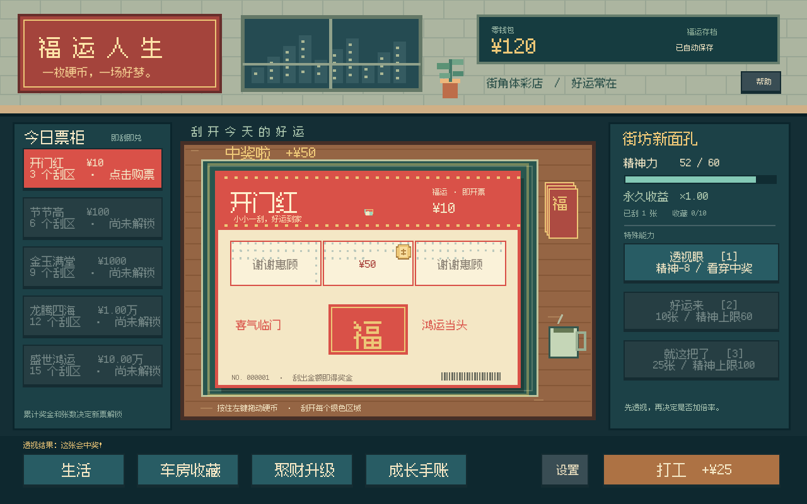

# 福运人生 · Fuyun Life

中国街角体彩店里的单机增量游戏。用一枚硬币刮开好运，用超能力改变奖池，把小日子过成自己的财富故事。

**版本：0.1.0 可玩原型 · 引擎：Godot 4.5.1 Standard / GDScript · 无额外插件、无需账号、无需联网**



## 试玩

Windows：下载试玩包，完整解压，双击 `FuyunLife.exe`。不需要安装 Godot。

开发：下载 [Godot 4.5.1 Standard](https://godotengine.org/download/archive/4.5.1-stable/)，导入根目录 `project.godot`，按 F6/F5 运行主场景。

推荐 1280×800；窗口可缩放，画面按比例适配。Windows 导出已生成，实际运行验证在 Linux 软件渲染环境完成，Windows 实机兼容性待后续试玩确认。

## 怎么玩

1. 左侧选票。按住鼠标左键拖动硬币，把每个银色区域刮开。
2. 格子里显示的金额相加后自动兑奖；未中奖的格子不产生收益。
3. `1` 透视眼：购买后、刮开前看到是否中奖。`2` 好运来：购买下一张前使用。`3` 就这把了：购买后、刮开前将本张奖金 ×3。透视后再决定加倍率，是一条基本策略。
4. 精神力自然缓慢恢复；生活菜单有喝茶、推拿、旅行、海岛度假，也有免费静坐。
5. 投资聚财升级提高所有新票奖金，购买车房提高精神上限和永久财运。
6. 刮满 30 张解锁长按空格快速刮票；`B` 再买同款；`Esc` 打开设置或关闭面板。
7. 收齐 5 辆车、5 套房，身家达到 1000 亿，获得虚构游戏世界的“全国首富”结局。通关后可继续玩。

设置里支持音效开关、减少动态、划过即刮。没有真钱充值、广告或内购。

## 本版内容

- 5 种原创中式票面，3 / 6 / 9 / 12 / 15 个可实际刮除的区域。
- 硬币指针、银粉碎屑、合成刮擦音、兑奖音和大奖庆祝。
- 3 种主动技能，12 级永久聚财升级，4 种付费恢复活动。
- 5 辆虚构车辆、5 套房产；车房、旅游、工作和技能的小动画。
- 首张教学票固定中奖且明确提示；连续 4 张未中奖后保证下一张中奖。
- 打工和免费静坐保障不会因资金或精神耗尽而卡死。
- 单槽自动存档、原子写入、备用存档、购票结果与随机数状态保存。
- 资金、刮票张数、前序收藏的组合解锁，防止一次大奖跳过完整成长。

## 开发结构

| 路径 | 职责 |
| --- | --- |
| `data/tickets.json` | 票价、格数、中奖率、大奖倍率、解锁、颜色 |
| `data/progression.json` | 技能、活动、资产、升级价格、收益系数、终局条件 |
| `scripts/core/economy.gd` | 注入随机数的纯奖池计算 |
| `scripts/core/game_state.gd` | 唯一数值事务入口、解锁、技能、兑奖 |
| `scripts/core/save_store.gd` | 存档校验、版本和原子写入 |
| `scripts/core/audio.gd` | 程序合成音效，和玩法随机数相互独立 |
| `scripts/ui/scratch_card.gd` | 空间刮擦、覆盖率、票面展示 |
| `scripts/ui/main.gd` | 场景组合、UI、输入、动画和反馈 |
| `scripts/ui/pixel_art.gd` | 可替换的程序像素绘制 |
| `tests/` | 核心回归检查和使用真实游戏逻辑的数值模拟 |
| `docs/` | 设计、迭代说明、模拟结果、实机截图 |

增加内容和改数值请从 [开发指南](docs/DEVELOPMENT.md) 开始。下一轮设计参考 [玩法设计](docs/DESIGN.md)。

## 测试与导出

安装 Godot 4.5.1，并将可执行程序命名为 `godot` 放入 PATH：

```bash
godot --headless --path . --editor --import
godot --headless --path . --script tests/run_tests.gd -- --test
godot --headless --path . --script tests/simulate.gd -- --test
```

模拟使用真实 `Game` 事务和 Godot 随机数，不是另一份近似公式。完整结果在 `docs/balance-report.json`。估计游玩时长不能代替真人试玩。

安装相同版本的导出模板后：

```bash
mkdir -p builds/windows builds/linux builds/web
godot --headless --path . --export-release "Windows Desktop"
godot --headless --path . --export-release "Linux"
godot --headless --path . --export-release "Web"
```

Web 导出需要通过 HTTP 提供整个目录，不能直接双击 HTML：`python3 -m http.server 8000 --directory builds/web`。浏览器保存使用本地存储，清理站点数据会丢失进度。

`.github/workflows/ci.yml` 检查每次提交；手动运行 `export.yml` 可以生成三平台构建。仓库未上传前这些工作流不会执行。

## 存档和素材

- Windows：`%APPDATA%\Godot\app_userdata\福运人生\progress.json`
- Linux：`~/.local/share/godot/app_userdata/福运人生/progress.json`
- 关闭窗口、数值事务、失焦和每 6 秒保存一次。已揭开的格子持久保存，尚未揭开格子的局部银粉轨迹不持久保存。
- 购票结果在第一次刮擦前固定并保存；重开游戏不能换中奖结果。部分刮擦后也不能回头用透视或倍率。
- 画面与音效为本项目原创程序素材。字体使用 Fusion Pixel Font（OFL-1.1）。详见 [素材与许可证](THIRD_PARTY_LICENSES.md)。

灵感来自刮票增量游戏，包括 [Scritchy Scratchy](https://store.steampowered.com/app/3948120/Scritchy_Scratchy/)。本项目未使用该游戏的代码、图片、音频或名称标识；票面、车名、财富榜和赔率均为虚构游戏设定。
