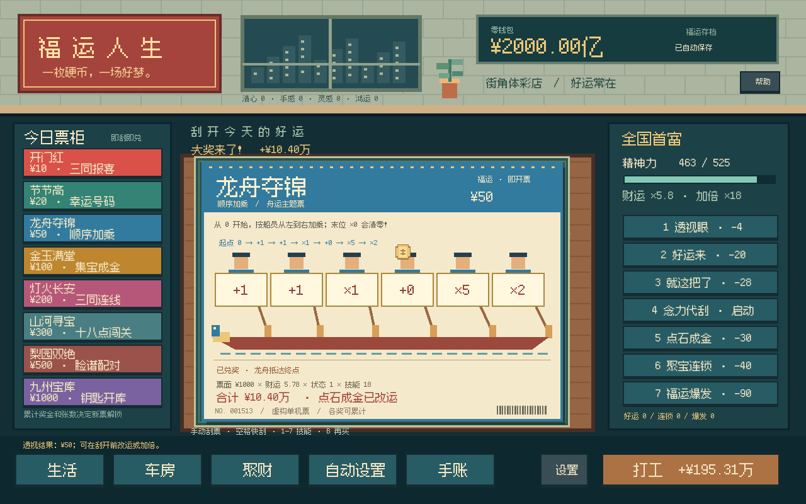

# 福运人生 · Fuyun Life

中国街角体彩店里的原创单机增量游戏。刮开银色涂层，按票面规则兑奖；用超能力改运，再把奖金换成车房、旅行与更强的自动化。

**v0.2.0 · Godot 4.5.1 Standard · GDScript · Compatibility · 无额外插件**



## 开始玩

1. 安装 **Godot 4.5.1 Standard**，导入根目录 `project.godot`。
2. 按 **F6/F5** 运行主场景。鼠标按住拖动硬币刮票，或按住 **空格**快速刮开。
3. **1–7** 使用技能，**B** 再买同款，**Esc** 开关设置。
4. 刮完 **12 张**解锁念力代刮。点击 **自动设置**选票、设备用金和后续技能策略，再按 **4**启动。
5. 最终收集 5 辆车、5 套房，身家达到游戏中的 **1000 亿**。

已有 v0.1 本机存档会自动迁移，钱、收藏和已有进度保留。已购旧版票先按原结果兑奖；下一张使用新玩法。启动游戏后自动化默认暂停，按 4 继续。

## v0.2 改了什么

| 票种 | 票价 | 规则 |
| --- | ---: | --- |
| 开门红 | 10 | 任意位置凑齐 3 个同号，按号码奖表兑奖 |
| 节节高 | 20 | 你的号码匹配幸运号码，获得对应格奖金 |
| 龙舟夺锦 | 50 | 按船员顺序加乘，末位 ×0 可以清零 |
| 金玉满堂 | 100 | 收集至少 3 个「宝」，按数量兑对应奖 |
| 灯火长安 | 200 | 横、竖、对角线三同号，多条中奖线相加 |
| 山河寻宝 | 300 | 每行三个数字之和恰好为 18，兑该行奖金 |
| 梨园双绝 | 500 | 同行两个脸谱同字同色，兑该行奖金 |
| 九州宝库 | 1000 | 同行三个号码全部被上方钥匙覆盖，开启宝库 |

每张票都显示规则和奖表，奖金由真实的数字/符号规则计算。不是先给一个数字，再把它藏到某个刮区。

- **7 个技能**：透视眼、好运来、就这把了、念力代刮、点石成金、聚宝连锁、福运爆发。
- **能形成组合**：透视龙舟 ×0 → 点石成金改为 ×2 → 就这把了放大到 ×8–18；连锁和度假可继续叠加。
- **分阶段自动化**：购票、刮开、兑奖；再解锁自动好运、自动透视/改运/加倍、自动娱乐续航。3 级效率升级、备用金保护、精神不足等待，菜单打开时暂停。
- **车房有用途**：车提高加倍技能、刮速并减免娱乐费用；房增加精神恢复，并解锁自动组合和自动续航。
- **娱乐有持续收益**：茶减精神消耗、按摩加刮速、旅行/度假提高后续若干张票的奖金。
- **正反馈**：中奖位置高亮、龙舟危险标记、奖金公式、改运前后变化、大奖弹幕与粒子音效。

这是虚构游戏经济，票价、概率和超能力用于增量成长，不对应真实彩票承诺。主题图案为项目原创像素绘制，未复制 Scritchy Scratchy 的素材或代码。

## 开发与维护

```text
scenes/main.tscn               主场景
scripts/core/ticket_rules.gd   独立生成/验奖/已揭示中奖提示
scripts/core/economy.gd        奖级概率与最终奖金计算
scripts/core/game_state.gd     钱包、技能、活动、自动循环、收藏事务
scripts/core/save_store.gd     schema 2 校验、原子保存、v0.1 迁移
scripts/ui/scratch_card.gd     各票种布局与银层刮擦
scripts/ui/main.gd             场景组合、菜单、动画和反馈
scripts/ui/pixel_art.gd        原创像素绘制
scripts/core/audio.gd          程序音效
data/tickets.json             8 种票的配置
data/progression.json         技能、资产、活动、自动效率、升级数值
tests/                       核心回归和成长模拟
docs/                        设计、开发、验证、更新日志和截图
```

请先读 [开发指南](docs/DEVELOPMENT.md)、[数值与设计](docs/DESIGN.md)、[验证记录](docs/VALIDATION.md) 和 [更新日志](CHANGELOG.md)。

```bash
godot --headless --path . --editor --import
godot --headless --path . --script tests/run_tests.gd -- --test
godot --headless --path . --script tests/simulate.gd -- --test
# 有显示环境：实际画面与自动循环检查，不读写正式存档
godot --path . -- --smoke
```

`--seeds=10` 可用于快速数值试算；只有完整 100 种子运行才写入 `docs/balance-report.json`。GitHub Actions 包含检查工作流和手动执行的 Windows / Linux / Web 导出工作流。导出模板版本必须与 Godot 一致。

## 临时素材与边界

像素画、音效由代码生成。中文使用 Fusion Pixel Font（OFL），Godot 为 MIT；完整授权见 [THIRD_PARTY_LICENSES.md](THIRD_PARTY_LICENSES.md)。

目前是可继续迭代的桌面原型：没有离线收益、转生、云存档、正式配乐或完整移动端适配。自动化只在游戏运行时推进。数值模拟用于发现卡点和失控增长，不能替代真人试玩对手感和趣味性的反馈。
